# 安装Visual Studio 专业版2022

> WDK包已经不支持 `2019` ，请更新到 `2022版本`
>
> 搜索 `最新` `全选` `即可`

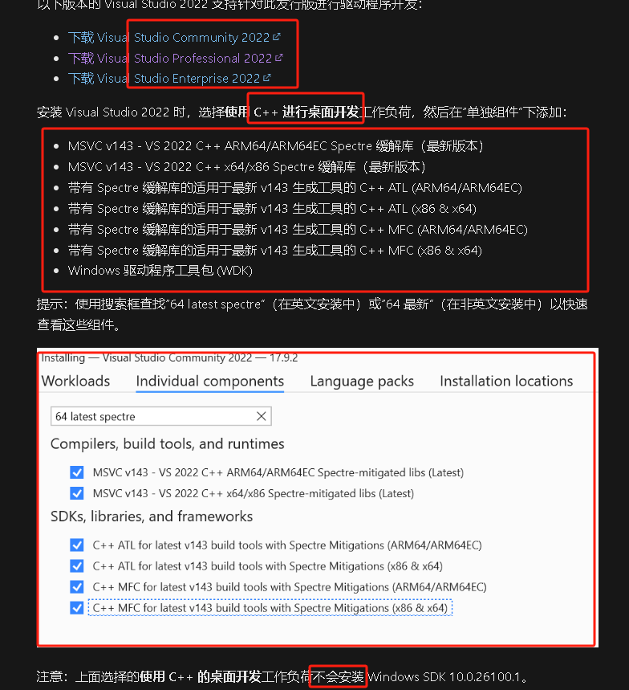

# 安装SDK

> 查看`系统`已经安装的 `SDK ` , 也可以在 上一步`安装过程中安装 SDK`，就不用再单独下载安装。
>
> 注： 检查 `系统本身`所存在的 环境，版本 过多，和`WDK 版本不匹配` 会导致WDK安装进去 Visual Studio `报错`  `版本不匹配`.
>
> 下载链接： https://learn.microsoft.com/zh-cn/windows-hardware/drivers/download-the-wdk

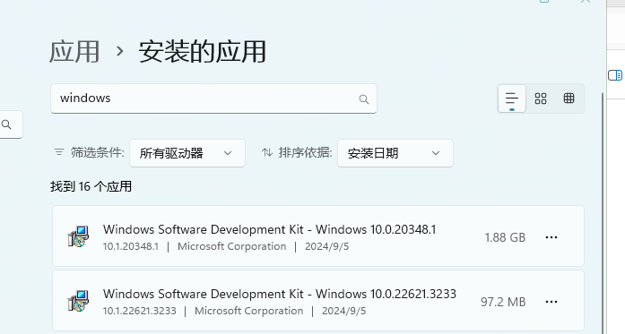

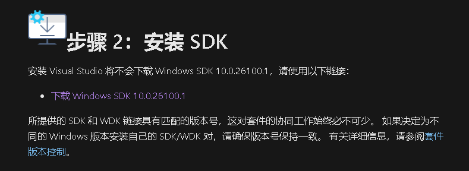

# 安装WDK

> 如果在 Visual Studio 中找不到驱动程序项目模板，则表示 `WDK Visual Studio` 扩展未正确安装。 要解决此问题，请从以下位置运行 `WDK.vsix` 文件：`C:\Program Files (x86)\Windows Kits\10\Vsix\VS2022\10.0.26100.1\WDK.vsix`。

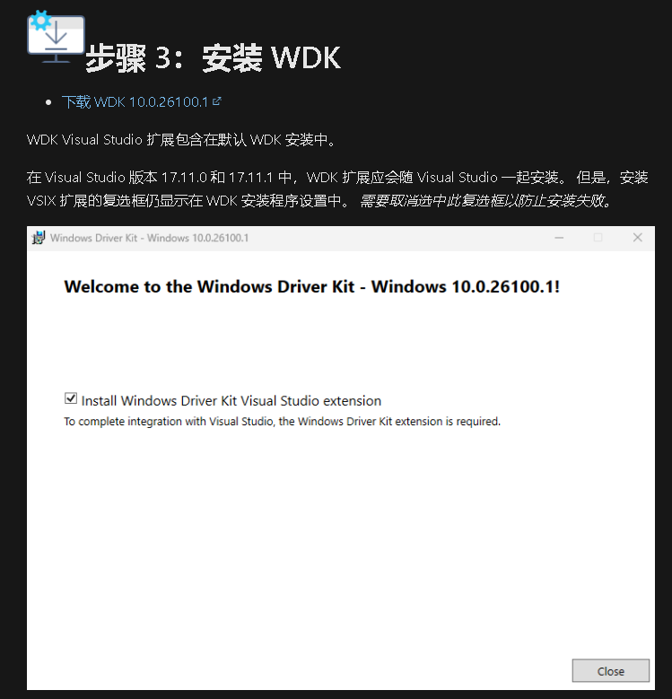

> 如果上述方式 `安装失败`，可以通过，在`插件里` 直接进行安装。如果还是`失败`？ 查看下面的 `该扩展的版本比 Visual Studio 要求的版本低`

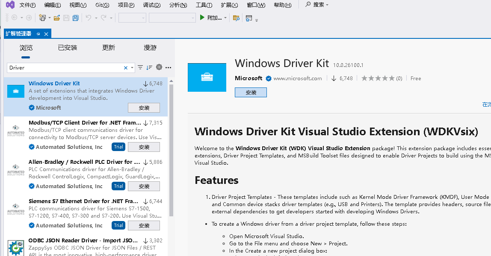


> `WDK`的 `版本` 要和 `自身`的 系统对应，避免安装之后 出现 `版本不兼容`，失败的问题

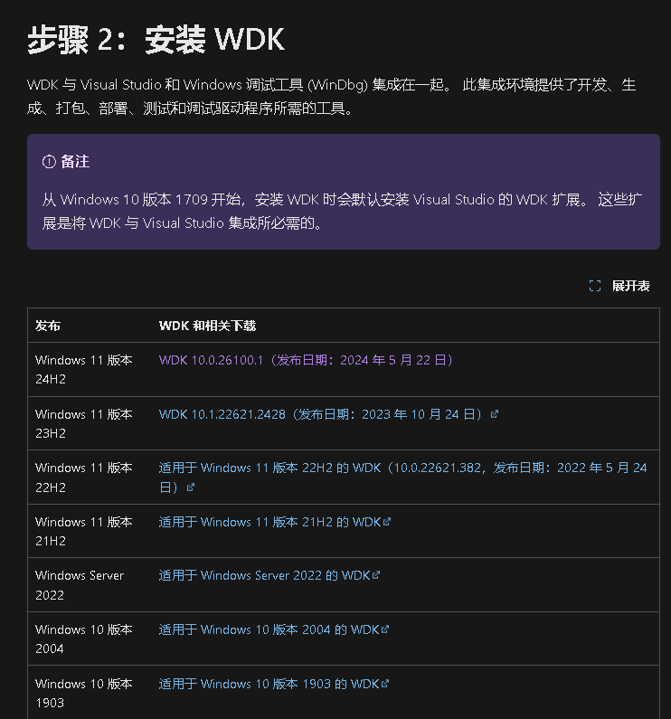

[以前的 WDK 版本和其他下载 - Windows drivers | Microsoft Learn](https://learn.microsoft.com/zh-cn/windows-hardware/drivers/other-wdk-downloads)


# 确保版本一致

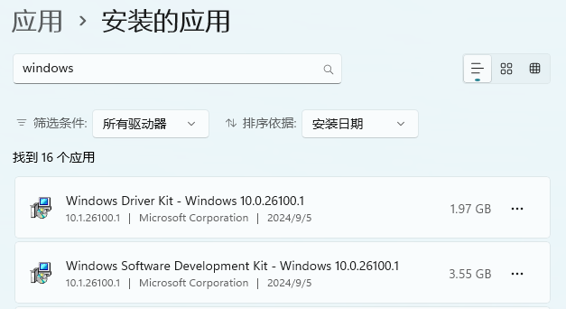


# 激活 

> Vs2022激活码：
>
> - **Pro:**
>   `TD244-P4NB7-YQ6XK-Y8MMM-YWV2J`
> - **Enterprise:**
>   `VHF9H-NXBBB-638P6-6JHCY-88JWH`

# 初始化运行问题

## 未找到 `ntddk.h`

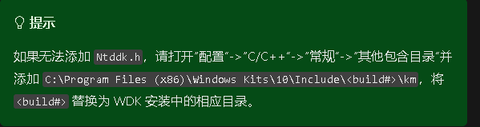

> ```txt
> C:\Program Files (x86)\Windows Kits\10\Include\10.0.22621.0\km\ntddk.h
> ```
>
> 确认您的 `windows kits `目录，加入到  `C++的附加项 ` 即可
>
> 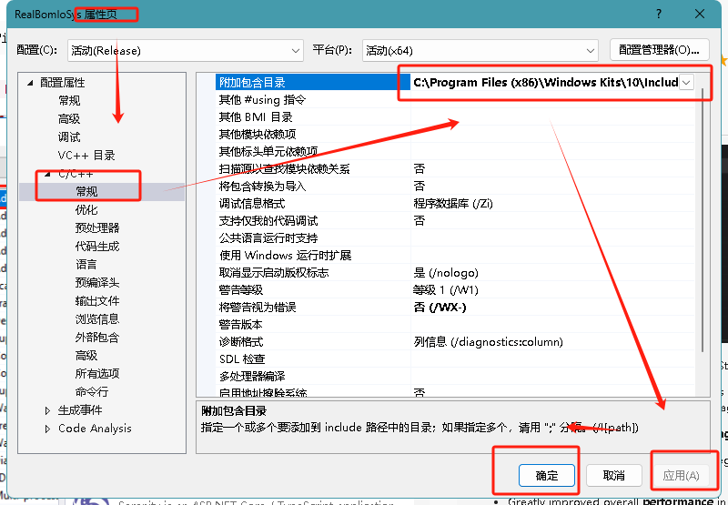

```c
严重性	代码	说明	项目	文件	行	禁止显示状态	详细信息
错误	C1083	无法打开包括文件: “ntddk.h”: No such file or directory	RealBomIoSys	D:\寄存器\RealBom寄存器\RealBomWinIO\WinIo源码\WinRing0Sys\OpenLibSys.c	1
```

# 创建Hello Word驱动

> * 打开 `Microsoft Visual Studio`。 在`文件` 菜单上，选择`新建`>`项目`。

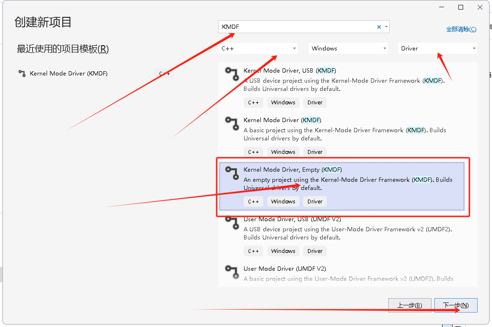

> 生成的 `解决方案`

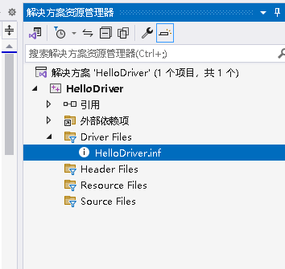

> 在 `Source Files`文件夹中创建 `Driver.c`文件
>
> 编写函数

```c
#include <ntddk.h> //包含所有驱动程序的核心Widnows内核定义，
#include <wdf.h> // 基于Windows 驱动程序框架WDF的驱动程序的定义

DRIVER_INITIALIZE DriverEntry;
EVT_WDF_DRIVER_DEVICE_ADD KmdfHelloWorldEvtDeviceAdd;


// 驱动程序的入口函数
NTSTATUS
DriverEntry(
    _In_ PDRIVER_OBJECT     DriverObject,
    _In_ PUNICODE_STRING    RegistryPath
)
{
    // NTSTATUS variable to record success or failure
    NTSTATUS status = STATUS_SUCCESS;

    // Allocate the driver configuration object
    WDF_DRIVER_CONFIG config;

    // Print "Hello World" for DriverEntry
    KdPrintEx((DPFLTR_IHVDRIVER_ID, DPFLTR_INFO_LEVEL, "KmdfHelloWorld: DriverEntry\n"));

    // Initialize the driver configuration object to register the
    // entry point for the EvtDeviceAdd callback, KmdfHelloWorldEvtDeviceAdd
    WDF_DRIVER_CONFIG_INIT(&config,
        KmdfHelloWorldEvtDeviceAdd
    );

    // Finally, create the driver object
    status = WdfDriverCreate(DriverObject,
        RegistryPath,
        WDF_NO_OBJECT_ATTRIBUTES,
        &config,
        WDF_NO_HANDLE
    );
    return status;
}

// 系统检查到你的设备已到达时，会调用  EvtDeviceAdd 任务时初始化该设备的结构与资源
NTSTATUS
KmdfHelloWorldEvtDeviceAdd(
    _In_    WDFDRIVER       Driver,
    _Inout_ PWDFDEVICE_INIT DeviceInit
)
{
    // We're not using the driver object,
    // so we need to mark it as unreferenced
    UNREFERENCED_PARAMETER(Driver);

    NTSTATUS status;

    // Allocate the device object
    WDFDEVICE hDevice;

    // Print "Hello World"
    KdPrintEx((DPFLTR_IHVDRIVER_ID, DPFLTR_INFO_LEVEL, "KmdfHelloWorld: KmdfHelloWorldEvtDeviceAdd\n"));

    // Create the device object
    status = WdfDeviceCreate(&DeviceInit,
        WDF_NO_OBJECT_ATTRIBUTES,
        &hDevice
    );
    return status;
}
```

> 点击生成之后，就可以查看自己生成的 `sys驱动文件 `。

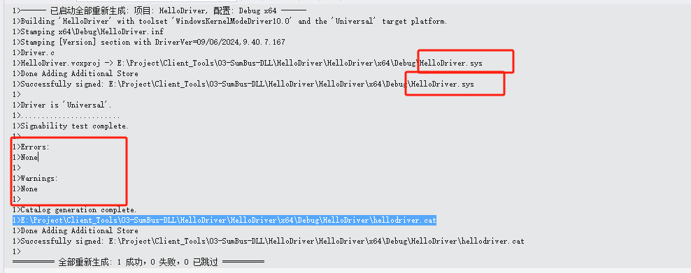

# 调用测试驱动

> 生成的`驱动文件`
>
> - `HelloDriver.sys` - 内核模式`驱动程序文件`
> - `HelloDriver.inf` - 在安装驱动程序时 Windows 使用的`信息文件`
> - `HelloDriver.cat `- 安装程序验证驱动程序的`测试签名`所使用的目录文件

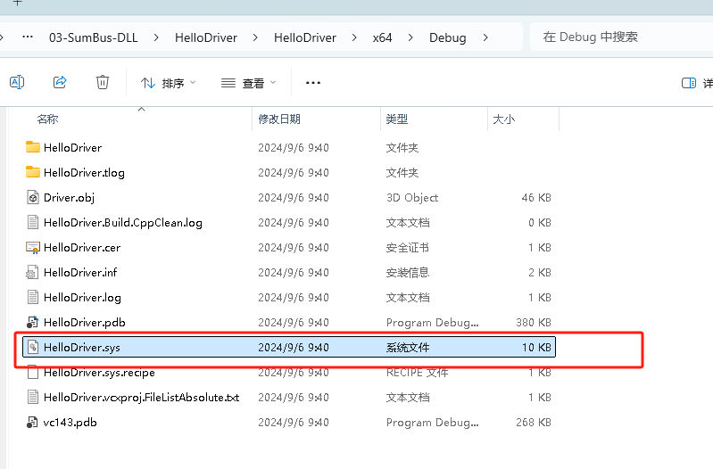

> 以`管理员身份`运行 `DriverMonitor`

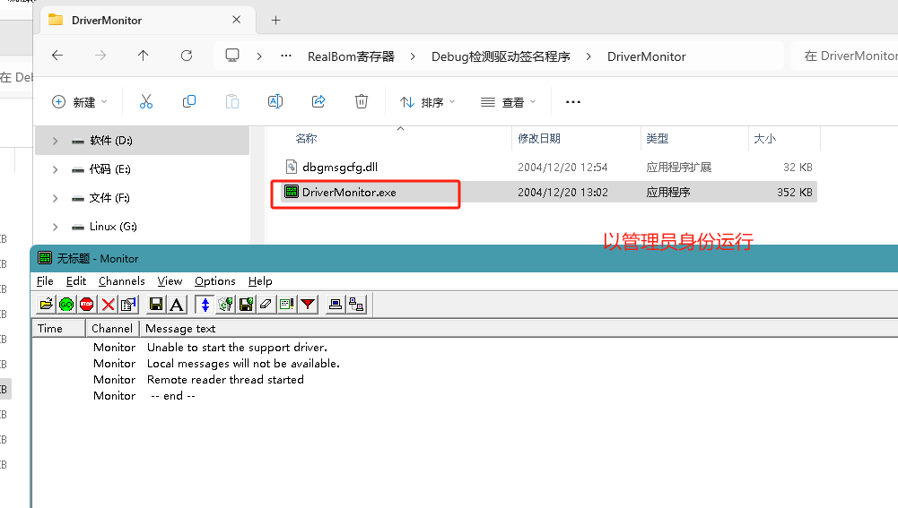

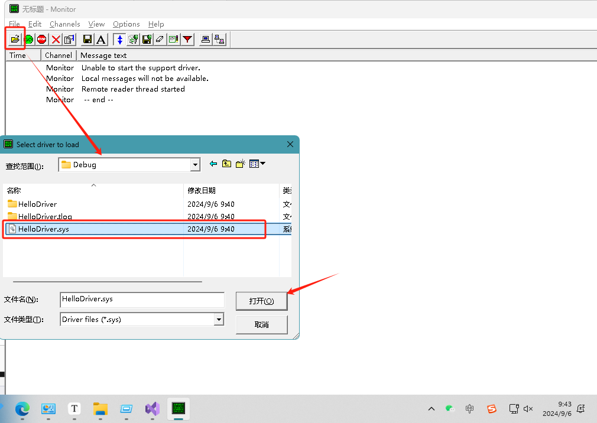

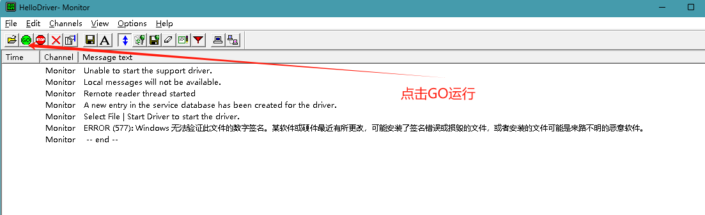

> 由于 `sys文件`，目前系统 都有`签名认证`要求，对于`没有签名认证`的，都会默认被`Windows系统拦截`。

# 调试方案

> * 启动系统测试模式     cmd中以管理员身份运行执行此指令`bcdedit /set testsigning on`  然后重启

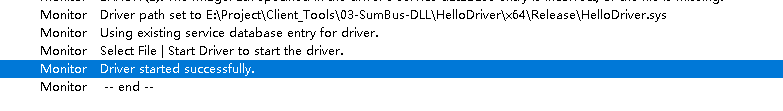

> * 获取打印的测试结果
> * 使用  `Dbgview` 工具，它会`实时打印 `当前系统的 `驱动输出` 后续章节 进行更新。

# 参考链接

> * [下载 Windows 驱动程序工具包 (WDK) - Windows drivers | Microsoft Learn](https://learn.microsoft.com/zh-cn/windows-hardware/drivers/download-the-wdk)
>
> * [编写 Hello World Windows 驱动程序 (KMDF) - Windows drivers | Microsoft Learn](https://learn.microsoft.com/zh-cn/windows-hardware/drivers/gettingstarted/writing-a-very-small-kmdf--driver)