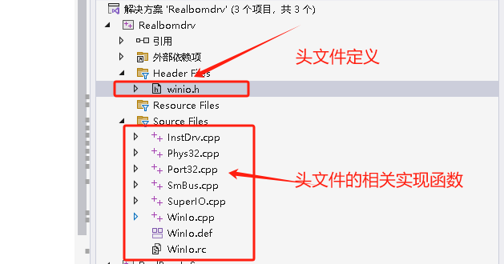
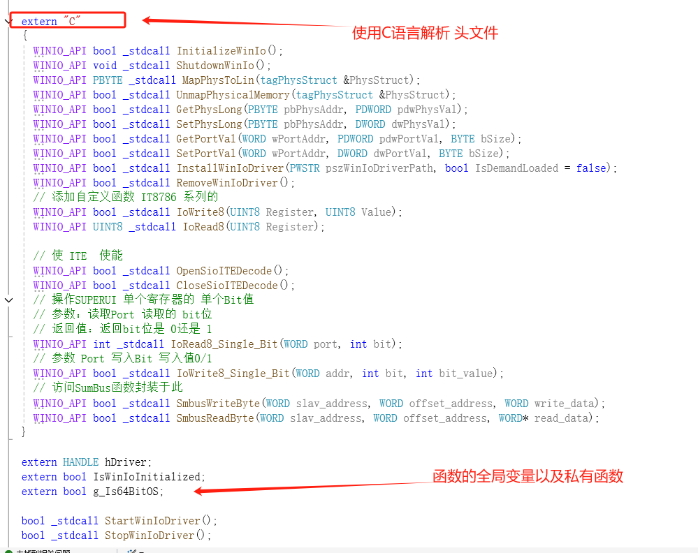
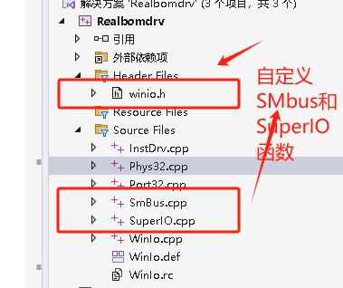

# 代码结构

> * 头文件 中定义 引用所需要的头文件 供动态和静态调用时使用
> * Source文件中定义头文件实现函数



# 头文件



# 基础函数

> `相关细节`，可以查看本文件夹的`WINIO源码`

## `CreateFile`

> 此函数可以创建新文件或打开现有文件，必须指定文件名，创建文件说明和其他属性。
>
> 创建或打开文件或I/O设备。常用的I/O设备有：文件，文件流，目录，物理磁盘，卷，控制台缓冲区，磁带驱动器，通信资源，邮筒和管道。该函数返回一个句柄，该句柄可用于根据文件或设备以及指定的标志和属性访问文件或设备以获取各种类型的I/O.

```cpp
HANDLE WINAPI CreateFile(
  _In_     LPCTSTR lpFileName,//要创建或打开的文件或设备的名称
  _In_     DWORD dwDesiredAccess,// 所请求的文件或设备访问权限，可以被概括为读，写，两者或非
  _In_     DWORD dwShareMode,// 文件或设备的请求共享模式，可以读取，写入，删除，全部或全部删除
  _In_opt_ LPSECURITY_ATTRIBUTES lpSecurityAttributes,//指向SECURITY_ATTRIBUTES结构的指针，该结构包含两个独立相关的数据成员，一个可选的安全描述符以及一个布尔值，该值确定返回的句柄是否可以被子进程继承，若为NULL则由CreateFile返回的句柄不能由应用程序可能创建的任何子进程继承，并且与返回句柄关联的文件或设备将获得默认安全描述符
  _In_     DWORD dwCreationDisposition,//采用存在或不存在的文件或设备的操作
  _In_     DWORD dwFlagsAndAttributes,// 文件或设备属性和标志
  _In_opt_ HANDLE hTemplateFile// 具有GENERIC_READ访问权限的模版文件的有效句柄
);
```

## DeviceIoControl

>  `DeviceIoControl` 是一个` Windows API `函数，用于与`设备驱动程序`进行通信。这个函数可以用来`发送控制代码`和`接收响应`

```cpp
BOOL DeviceIoControl(
    HANDLE hDevice,              // 设备的句柄
    DWORD dwIoControlCode,       // 控制代码
    LPVOID lpInBuffer,           // 输入缓冲区
    DWORD nInBufferSize,         // 输入缓冲区大小
    LPVOID lpOutBuffer,          // 输出缓冲区
    DWORD nOutBufferSize,        // 输出缓冲区大小
    LPDWORD lpBytesReturned,     // 返回的字节数
    LPOVERLAPPED lpOverlapped     // 重叠结构
);
```

# 实现函数

> * 实现对`指定内存`的`访问接口`。
> * 实现对某个`SuperIO`的某个`bit位`的控制。
> * 实现对`SumBus`的访问

> 在`winIo`的`头文件`中加入如下 `函数`，并在相关的`cpp函数`中`进行实现`。

```c
// 添加自定义函数 IT8786 系列的
WINIO_API bool _stdcall IoWrite8(UINT8 Register, UINT8 Value);
WINIO_API UINT8 _stdcall IoRead8(UINT8 Register);

// 使 ITE  使能 superIo访问 接口已验证 可行
WINIO_API bool _stdcall OpenSioITEDecode();
WINIO_API bool _stdcall CloseSioITEDecode();
// 操作SUPERUI 单个寄存器的 单个Bit值
// 参数：读取Port 读取的 bit位
// 返回值：返回bit位是 0还是 1
WINIO_API int _stdcall IoRead8_Single_Bit(WORD port, int bit);
// 参数 Port 写入Bit 写入值0/1
WINIO_API bool _stdcall IoWrite8_Single_Bit(WORD addr, int bit, int bit_value);


// 以机型
// 控制某个GPIO 的函数 传入参数 GPIO pin编号 ，高1 或者 低0

// SMBIOS访问 控制
// 访问SumBus函数封装于此
WINIO_API bool _stdcall SmbusWriteByte(WORD slav_address, WORD offset_address, WORD write_data);
WINIO_API bool _stdcall SmbusReadByte(WORD slav_address, WORD offset_address, WORD* read_data);

//给接口访问内存 l来进行控制 可行 已验证
WINIO_API bool _stdcall MemoryTest();
WINIO_API DWORD _stdcall GetMemoryTest();
```


## 自定义步骤

> * 首先在`winio.h`中定义头文件
> * 然后在具体的函数中，可自己`定义`应用`头文件`，并对`头文件`进行实现
> * 在进行自定义函数封装时，尽量调用不要过于封装，避免出现访问失败问题。例如在访问`SMBus时`就调用了`SuperIO`的封装，`SuperIO`有调用API接口，API调用系统接口，一个函数调用太多，容易出问题。



## `SuperIO`自定义函数

```cpp
// ---------------------------------------------------- //
//				对SuperIO相关的定制化函数                //
// ---------------------------------------------------- //

#include <windows.h>
#include "winio.h"


UINT8  IT8728F_CONFIG_INDEX = 0x2e;
UINT8  IT8728F_CONFIG_DATA = 0x2f;
bool _stdcall IoWrite8(UINT8 Register, UINT8 Value)
{
    if (SetPortVal((WORD)Register, (WORD)Value, 1))
    {
        return true;
    }
    else
    {
        return false;
    }
    
}
UINT8 _stdcall IoRead8(UINT8 Register)
{
    DWORD portValue = 0x0; // 用于存储读取的值
    GetPortVal(Register, &portValue, 1);
    return portValue; // 只返回低8位
}

bool _stdcall OpenSioITEDecode()
{
    IoWrite8(IT8728F_CONFIG_INDEX, 0x87);
    IoWrite8(IT8728F_CONFIG_INDEX, 0x01);
    IoWrite8(IT8728F_CONFIG_INDEX, 0x55);
    IoWrite8(IT8728F_CONFIG_INDEX, 0x55);
    return true;
}
bool _stdcall CloseSioITEDecode()
{
    IoWrite8(IT8728F_CONFIG_INDEX, 0x02);
    IoWrite8(IT8728F_CONFIG_DATA, 0x02);
    return true;
}

int _stdcall IoRead8_Single_Bit(WORD port, int bit)
{
    BYTE Value = 0x0;
    DWORD val = 0x0;
    if (GetPortVal(port, &val, 1)) // Can be 1 (BYTE), 2 (WORD) or 4 (DWORD).
    {
        // 获取 val 的第 bit 位的值
        if (bit < 0 || bit >= 32) // 确保 bit 在合法范围内
        {
            return -1; // 返回错误代码
        }
        // 使用位操作获取对应的 bit 位
        int bitValue = (val >> bit) & 1; // 右移 bit 位并与 1 进行与操作
        return bitValue; // 返回对应 bit 位的值（0或1）
    }
    else
    {
        return -1;
    }

}

bool _stdcall IoWrite8_Single_Bit(WORD addr, int bit, int bit_value)
{
    BYTE Curr_Value = IoRead8(addr);
    // 根据条件与或操作来更新对应的值
    if (bit_value == 1)
    {
        // 将第bit位设置为1
        Curr_Value |= (1 << bit);
    }
    else
    {
        // 将第bit位设置为0
        Curr_Value &= ~(1 << bit);
    }
    // 将更新后的值 写入
    if (SetPortVal(addr, Curr_Value, 1))
    {
        return true;
    }
    else
    {
        return false;
    }
    return true;
}

```

## `内存`测试函数

```cpp

bool _stdcall MemoryTest()
{
	if (SetPhysLong(0x00000000, 0x44000200))
	{
		return true;
	}
	else
	{
		return false;
	}
}

DWORD _stdcall GetMemoryTest()
{
	DWORD val = 0x0;
	GetPhysLong(0x00000000, &val);
	return val;
}

```


## `SMBus`自定义函数

```cpp
// ---------------------------------------------------- //
//				对SMBus进行访问的相关函数                //
// ---------------------------------------------------- //
#include <windows.h>
#include "winio.h"
WORD Sumbus_base = 0xf000;


// 使用动态链接库 来进行 IO Space的函数 请直接使用原生的函数，不要嵌套那么多层，否则会出现访问失效的问题
bool _stdcall SmbusWriteByte(WORD slav_address, WORD offset_address, WORD write_data)
{

    int Timer_Num = 0;
    DWORD val = 0x0; // 存储读到的值
    // 初始化超时时间位 0
    unsigned long timeout = 0;
    // 使用outb方法将write_date的值写入到I/O端口地址0xf005
    /*
        端口IO
        * port I/O 地址，此地址位虚拟地址
        * data 位写入数据
    */
    SetPortVal(Sumbus_base + 0x05,write_data,1);
    // 将0x1f的值写入指定的I/O端口地址0xf000
    SetPortVal(Sumbus_base, 0x1f, 1);
    while (1)
    {
        // inb读取指定寄存器的值 0xf000
        DWORD val = 0x0;
        GetPortVal(Sumbus_base, &val, 1); // Can be 1 (BYTE), 2 (WORD) or 4 (DWORD).
        // 暂停10微妙
        //usleep(10);
        Sleep(10);
        // 检查对应的值最低为是否为 0
        if ((val & 0x1) == 0)
        {
            break;
        }
        // 超市时间
        timeout++;
        // 10微妙一次，相当于超过一秒，访问超时
        if (timeout > 100)
        {
            Timer_Num++;
            break;
        }
    }
    // 将slav_address基地址写到0xf004
    SetPortVal(Sumbus_base + 0x04, slav_address, 1);

    SetPortVal(Sumbus_base + 0x03, offset_address, 1);
    // 将0x48 写入到 0xf002
    SetPortVal(Sumbus_base + 0x02, 0x48, 1);
    // 将超时进行初始化
    timeout = 0;

    while (1)
    {
        // 读取0xf000的数据
        //tempvalue= io->inb(Sumbus_base);
        
        GetPortVal(Sumbus_base, &val, 1); // Can be 1 (BYTE), 2 (WORD) or 4 (DWORD).
        //usleep(10);
        Sleep(10);
        // 判断最低为是否为0
        if ((val & 0x1) == 0)
        {
            break;
        }
        timeout++;
        // 超时算上10微妙就为1秒
        if (timeout > 100)
        {
            Timer_Num++;
            break;
        }
    }
    // 如果tempvalue为零 则写入成功
    if ((val & 0x1C) != 0)
    {
        Timer_Num++;
    }
    if (Timer_Num != 0)
    {
        return false;
        //
    }
    else
    {
        return true;
    }
    return true;

}

bool _stdcall SmbusReadByte(WORD slav_address, WORD offset_address, WORD* read_data)
{

    int Timer_Num = 0;
    // 记录读取的值
    DWORD val = 0x0;
    // 设置超时时间
    unsigned long   timeout = 0;
    // 将0x1f写入0xf000
    SetPortVal(Sumbus_base, 0x1f, 1);

    while (1)
    {
        // 判断是否写入
        GetPortVal(Sumbus_base, &val, 1);
        Sleep(10);
        // 判断最低为是否为0
        if ((val & 0x1) == 0)
        {
            break;
        }
        timeout++;
        //
        if (timeout > 100)
        {
            Timer_Num++;
            //            perror("Smbus timeout!");
            break;
        }
    }
    // 将基地址+1存入寄存器IO 0xf004
    // +1 为读.
    SetPortVal(Sumbus_base + 0x04, (slav_address + 1), 1);
    // 将偏移量 写入 0xf003
    SetPortVal(Sumbus_base + 0x03, offset_address, 1);
    // 将0x48 写入 0x002
    SetPortVal(Sumbus_base + 0x02, 0x48, 1);

    timeout = 0;

    while (1)
    {
        GetPortVal(Sumbus_base, &val, 1);
        Sleep(10);
        if ((val & 0x1) == 0)
        {
            break;
        }
        timeout++;
        if (timeout > 100)
        {
            Timer_Num++;
            //            perror("Smbus timeout!");
            break;
        }
    }
    if ((val & 0x1C) != 0)
    {
        Timer_Num++;
    }
    else
    {
        GetPortVal(Sumbus_base, &val, 1);
        *read_data = val;
    }
    if (Timer_Num != 0)
    {
        return false;
    }
}
```


# 参考资料

> https://blog.csdn.net/li_wen01/article/details/80142931
