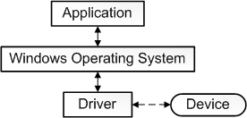

# 基础流程

> `驱动程序`是一个软件组件，它允许`操作系统`和`设备`进行通信。




# 函数解析


## `DriverEntry`

> 主要对驱动程序进行初始化，由系统进程`System调用`。
>
> * 为`驱动程序`的标准例程提供`入口点`。

```cpp
NTSTATUS DriverEntry(
  _In_ PDRIVER_OBJECT  DriverObject,
  _In_ PUNICODE_STRING RegistryPath
);
```

## KdPrint

> * 驱动打印`Logo信息`
> * 通过`驱动检测工具`来抓取 `Logo`

```cpp
KdPrint(("Entering DriverEntry"));
```

## `rtlInitUnicodeString` 函数

> 函数初始化`Unicode` 字符的计数字符串

```cpp
// 如果成功返回 STATUS_SUCCESS
NTSYSAPI VOID RtlInitUnicodeString(
  [out]          PUNICODE_STRING         DestinationString,//指向要初始化的UNICODE_STRING结构的指针
  [in, optional] __drv_aliasesMem PCWSTR SourceString //指向以NULL结尾的宽字符字符串指针，用于初始化目的字符串指向的计数字符串
);

RtlInitUnicodeString(&DeviceNameUnicodeString, L"\\Device\\TestIO");
```

## `IoCreateDevice`

> 用于创建`供驱动程序`使用的`设备对象`

```cpp
NTSTATUS IoCreateDevice(
  [in]           PDRIVER_OBJECT  DriverObject, //指向调用方驱动程序对象的指针，每个驱动程序在指向DriverEntry例程的参数中接受指向其驱动程序对象的指针
  [in]           ULONG           DeviceExtensionSize,//指向要为设备对象的设备扩展分配的驱动程序确定的字节数
  [in, optional] PUNICODE_STRING DeviceName,// 指向包含以null结尾的Unicode字符串的缓冲区，该字符串为设备对象命名
  [in]           DEVICE_TYPE     DeviceType,//指定系统定义的 FILE_DEVICE_XXX 常量之一，这些常量指示设备 (的类型，例如FILE_DEVICE_DISK或FILE_DEVICE_KEYBOARD) 或供应商为新类型的设备定义值
  [in]           ULONG           DeviceCharacteristics,// 指定一个或多个系统定义的常量（ORed 在一起），这些常量提供有关驱动程序设备的其他信息。
  [in]           BOOLEAN         Exclusive, //指定设备对象是否表示独占设备
  [out]          PDEVICE_OBJECT  *DeviceObject // 指向变量的指针，该变量接受指向新创建的Device_OBJECT结构的指针
);

// WINIO驱动使用
ntStatus = IoCreateDevice(DriverObject,
	0,
	&DeviceNameUnicodeString,
	FILE_DEVICE_WINIO,
	0,
	FALSE,
	&DeviceObject);

```

## `IoCreateSymbolicLink`

> `IoCreateSymbolicLink` 例程在设备`对象名称`和设备的用户可见名称之间设置`符号链接`

```cpp
// 创建成功之后 返回 STATUS_SUCCESS
NTSTATUS IoCreateSymbolicLink(
  [in] PUNICODE_STRING SymbolicLinkName, //指向用户可见名称的缓冲Unicode字符串的指针
  [in] PUNICODE_STRING DeviceName // 指向缓冲Unicode字符串的指针，该字符串时驱动程序创建的设备对象的名称
);
```

## `ioDeleteDevice`

> `ioDeleteDevice` 例程从系统中`删除设备对象`，例如：从系统中`删除基础设备时`

```cpp
void IoDeleteDevice(
  [in] PDEVICE_OBJECT DeviceObject // 指向要删除的设备对象的指针
);

//WINIO使用
if (!NT_SUCCESS(ntStatus))
{
    // Symbolic link creation failed- note this & then delete the
    // device object (it's useless if a Win32 app can't get at it).

    KdPrint(("RealBom:ERROR: IoCreateSymbolicLink failed"));

    IoDeleteDevice(DeviceObject);
}
```

## `IoGetCurrentIrpStackLocation`

> `IoGetCurrentIrpStackLocation`例程返回指向指定`IRP中`调用方`I/O堆栈`位置的`指针`

```cpp
__drv_aliasesMem PIO_STACK_LOCATION IoGetCurrentIrpStackLocation(
  [in] PIRP Irp  // 指向 IRP 的指针。
);

// WINIO示例
// Init to default settings

Irp->IoStatus.Status = STATUS_SUCCESS;
Irp->IoStatus.Information = 0;

IrpStack = IoGetCurrentIrpStackLocation(Irp);

// Get the pointer to the input/output buffer and it's length

pvIOBuffer = Irp->AssociatedIrp.SystemBuffer;
dwInputBufferLength = IrpStack->Parameters.DeviceIoControl.InputBufferLength;
dwOutputBufferLength = IrpStack->Parameters.DeviceIoControl.OutputBufferLength;
```

> 每个驱动程序都`必须使用发送的每个 IRP` 调用 `IoGetCurrentIrpStackLocation` ，以获取当前请求的任何参数。 除非驱动程序为驱动程序处理的每个`IRP_MJ_\*XXX` 代码提供调度例程，否则驱动程序还`必须`在 `IRP` 中检查其` I/O `堆栈位置，以确定正在请求的操作。


## WRITE_PORT_UCHAR

> 将字节`写入`指定的`端口地址`

```cpp
void WRITE_PORT_UCHAR(
  [in] PVOID Port,  // 指向端口的指针，该端口必须是I/O空间中的映射内存范围
  [in] ULONG Value  // 指定要写入端口的字节
);

//WINIO示例代码

memcpy(&PortStruct, pvIOBuffer, dwInputBufferLength);
switch (PortStruct.bSize)
{
    case 1:
        WRITE_PORT_UCHAR((PUCHAR)(USHORT)PortStruct.wPortAddr, (UCHAR)PortStruct.dwPortVal);
        break;
    case 2:
        WRITE_PORT_USHORT((PUSHORT)(USHORT)PortStruct.wPortAddr, (USHORT)PortStruct.dwPortVal);
        break;
    case 4:
        WRITE_PORT_ULONG((PULONG)(USHORT)PortStruct.wPortAddr, PortStruct.dwPortVal);
        break;
}
```

## READ_PORT_UCHAR

> 从指定的`端口地址`读取`字节`

```cpp
UCHAR READ_PORT_UCHAR(
  [in] PVOID Port  //指定端口地址，该地址必须是I/O空间中的映射内存范围
);


// WINIO示例代码
switch (PortStruct.bSize)
{
    case 1:
        PortStruct.dwPortVal = (ULONG)READ_PORT_UCHAR((PUCHAR)(USHORT)PortStruct.wPortAddr);
        break;
    case 2:
        PortStruct.dwPortVal = (ULONG)READ_PORT_USHORT((PUSHORT)(USHORT)PortStruct.wPortAddr);
        break;
    case 4:
        PortStruct.dwPortVal = READ_PORT_ULONG((PULONG)(USHORT)PortStruct.wPortAddr);
        break;
}
```

## ZwOpenSection

> 打开现有[节对象的](https://learn.microsoft.com/zh-cn/windows-hardware/drivers/)句柄。

```cpp
NTSYSAPI NTSTATUS ZwOpenSection(
  [out] PHANDLE            SectionHandle,// 指向 HANDLE 变量的指针，该变量接收 section 对象的句柄。
  [in]  ACCESS_MASK        DesiredAccess,//指向一个ACCESS_MASK值，该值确定对对象的请求访问权限
  [in]  POBJECT_ATTRIBUTES ObjectAttributes // 该结构指定对象名称和其他属性
);
```

## `HalTranslateBusAddress`

> This function translates a physical bus address to a physical system address.
>
> 该函数将物理总线地址转换为物理系统地址。

```cpp
BOOL HalTranslateBusAddress( 
  INTERFACE_TYPE InterfaceType, // 表示总线接口类型。支持总线类型的上限始终是MaximumInterfaceType。这指示了设备使用的总线类型，如果PCI，ISA等
  ULONG BusNumber,  // 设备的零基系统分配总线编号。用于在同一类型的多个总线中识别总线
  PHYSICAL_ADDRESS BusAddress, //相对于总线的地址，此地址通常是设备在总线上的物理地址
  PULONG AddressSpace, //输入时初始化为PULONG,输出时为端口号或内存地址，值0x0表示内存地址，0x1表示I/O空间
  PPHYSICAL_ADDRESS TranslatedAddress // 指向转换后地址的指针，此参数返回的地址可以被设备驱动程序使用
);
```

## ZwMapViewOfSection

> 将节的视图映射到主题进程的虚拟地址空间中

```cpp
NTSYSAPI NTSTATUS ZwMapViewOfSection(
  [in] HANDLE SectionHandle,//节对象的句柄，
  [in] HANDLE ProcessHandle,// 对象的句柄，该对象表示视图应映射到的进程。
  [in, out]  PVOID *BaseAddress, // 指向接受视图基址的变量的指针
  [in]   ULONG_PTR  ZeroBits, // 指定视图基址中必须为0的高序地址位数
  [in]   SIZE_T  CommitSize,// 指定视图的初始提交区域的大小(以字节为单位)
  [in, out, optional] PLARGE_INTEGER  SectionOffset,// 指向变量的指针，该变量接收从节开头到视图的偏移量(以字节为单位)
  [in, out]   PSIZE_T         ViewSize,// 指向SIZE_T变量的指针
  [in]   SECTION_INHERIT InheritDisposition,// 指向如何与子进程共享视图
  [in]   ULONG  AllocationType,// 指定一组表示，用于描述要为指定的页面区域执行的分配类型
  [in]    ULONG   Win32Protect// 指定要应用于映射视图的页面保护
);
```

## ZwUnmapViewOfSection

> 从主题进程的虚拟地址空间中取消映射节的视图

```cpp
NTSYSAPI NTSTATUS ZwUnmapViewOfSection(
  [in] HANDLE ProcessHandle, //以前传递给 ZwMapViewOfSection的进程对象的句柄
  [in, optional] PVOID  BaseAddress // 指向要取消映射的视图基虚拟地址的指针，可是视图中的任何虚拟地址
);
```

> 此例程从`指定进程的虚拟地址空间`中`取消映射`包含` *BaseAddress`* 的节的`整个视图`，即使` *BaseAddress`* 未指向视图的开头也是如此。

## `ObDereferenceObject`

> `递减`给定对象的引用次数并执行`保留检查`
>
> `ObDereferenceObject`  返回为系统使用保留的值。`驱动程序`必须将此值视为VOID

```cpp
void ObDereferenceObject(
  [in]  a //指向对象主体的指针
);
```

## `zwClose`

> `zwClose` 例程`关闭对象句柄`
>
> **wClose** 是一个泛型例程，可对任何类型的对象进行操作。

```cpp
NTSYSAPI NTSTATUS ZwClose(
  [in] HANDLE Handle  //任何类型的对象的句柄
);
```

## DeviceIoControl

> 将控制代码直接发送到指定的设备驱动程序，相应的设备执行应用的操作

```cpp
BOOL DeviceIoControl(
  [in]                HANDLE       hDevice, //设备句柄
  [in]                DWORD        dwIoControlCode,// 操作的控制码，在winio_nt.h 文件或者 sys头文件中
  [in, optional]      LPVOID       lpInBuffer,//指向输入缓冲区的指针，其中包含执行操作所需的数据
  [in]                DWORD        nInBufferSize,//输入缓冲区的大小
  [out, optional]     LPVOID       lpOutBuffer,//指向输出缓冲区的指针，用于接收操作返回的数据
  [in]                DWORD        nOutBufferSize,// 输出缓冲区的大小
  [out, optional]     LPDWORD      lpBytesReturned,// 指向变量的指针，改变量接受存储在输出缓冲区中的数据的大小(以字节为单位)
  [in, out, optional] LPOVERLAPPED lpOverlapped// 指向 OVERLAPPED 结构的指针。
);
```


