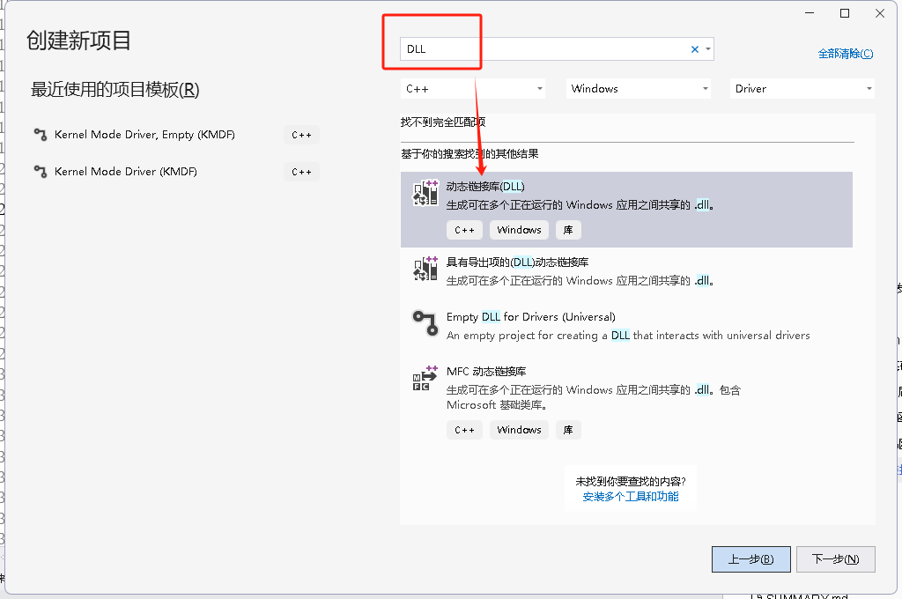
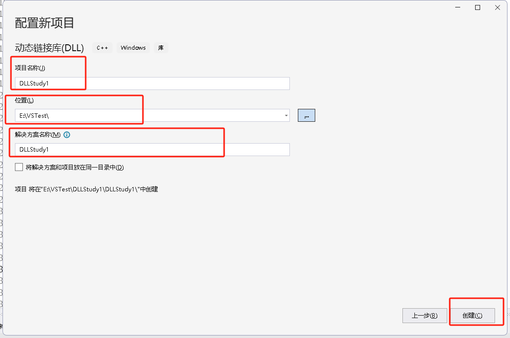
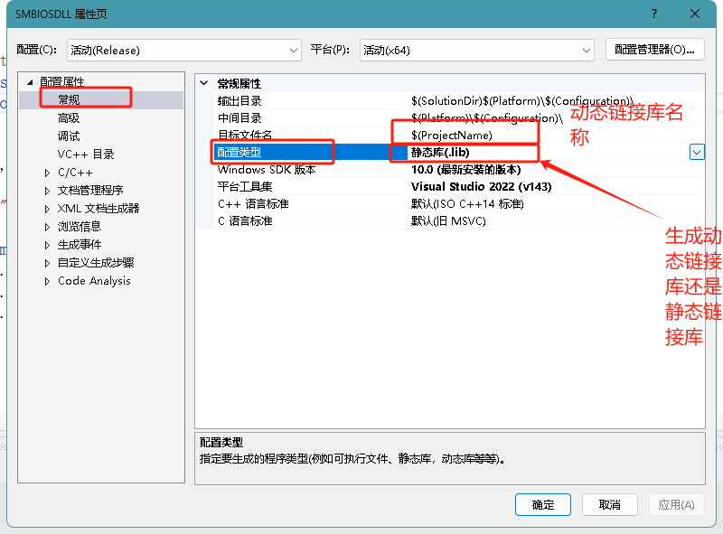
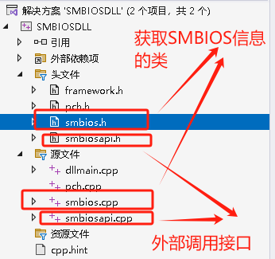
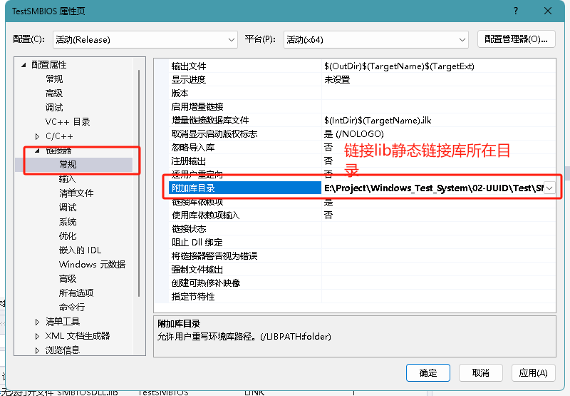
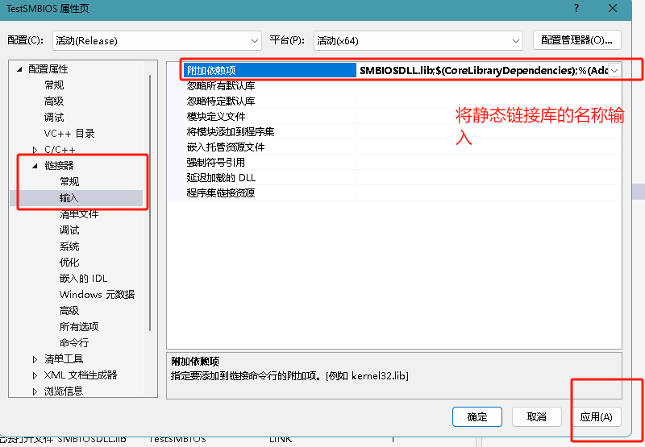
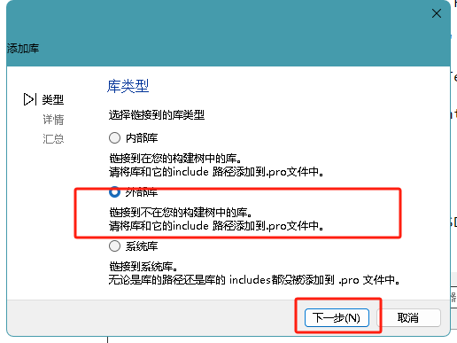
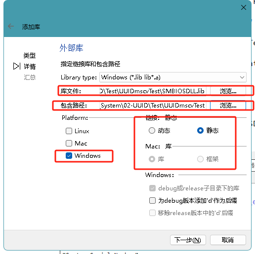

# 需求

> 创建A项目： 有函数 和 类 ，将A项目生成 DLL 动态链接库
>
> 创建B项目：使用A项目生成的DLL和lib相关文件。


# 创建项目








# 创建文件



> `smbios.h` 和 `smbios.cpp`使用 `开源库 `： `DumpSMBIOS` https://github.com/KunYi/DumpSMBIOS

# 头文件

> * 对于 全局变量 但是 在实现函数中需要全局使用，请放到对应的 实现函数 当中

```c
#ifndef SMBIOSAPI_H_
#define SMBIOSAPI_H_

#include <Windows.h>
#define _DllExport _declspec(dllexport) //使用宏定义缩写下
// for Type 0
typedef struct {
    PWCHAR m_wszBIOSVendor;
    PWCHAR m_wszBIOSVersion;
    PWCHAR m_wszBIOSReleaseDate;
    DWORD  m_BIOSSysVersion;
    DWORD  m_BIOSECVersion;
} BIOSInfo;  

// for Type 1
typedef struct {
    PWCHAR m_wszSysManufactor;
    PWCHAR m_wszSysProductName;
    PWCHAR m_wszSysVersion;
    PWCHAR m_wszSysSerialNumber;
    UUID   m_SysUUID;
    PWCHAR m_wszSysSKU;
    PWCHAR m_wszSysFamily;
} SystemInfo;
// for Type 2
typedef struct {
    PWCHAR m_wszBoardManufactor;
    PWCHAR m_wszBoardProductName;
    PWCHAR m_wszBoardVersion;
    PWCHAR m_wszBoardSerialNumber;
    PWCHAR m_wszBoardAssetTag;
    PWCHAR m_wszBoardLocation;
} BoardInfo;

// 函数 实现区域
extern "C"
{
	_DllExport void SMBIOS_INIT();  // 初始化SMBIOS数据
	_DllExport void SMBIOS_Free();  // 释放 SMBIOS 申请的 资源
	// 获取单个数据 
    _DllExport DWORD SMBIOS_Get_BIOS_Version();  // 获取 BIOS信息 结构体
	// 获取数据结构体 指针 传入 结构体指针，返回对应的结构体 数据
    _DllExport void SMBIOS_Get_BIOS_Info(BIOSInfo* info);  // 获取 BIOS信息 结构体
    _DllExport void SMBIOS_Get_SYSTEM_Info(SystemInfo* info); // 获取系统 信息 结构体
    _DllExport void SMBIOS_Get_BOARD_Info(BoardInfo* info);  // 获取主板 信息 结构体

    // 获取 UUID需要的 数据 包括  UUID  SysSerialNumber  BoardSerialNumber  SysSKU
    // 此函数 为 产线 UUID 测试 使用 传入对应  char 字符串 
    // 输出 对应的 字符串值
    _DllExport  wchar_t* SMBIOS_Get_UUID_Info(const char* UUID_Type);


}

#endif // SMBIOSAPI_H_
```


# 实现函数

> 实现函数 主要是 对 头文件中的 函数 进行实现。

```cpp
#include "pch.h" // use stdafx.h in Visual Studio 2017 and earlier
#include "smbiosapi.h"
#include "smbios.h"
#include <memory>

BIOSInfo* g_bios_info = nullptr;  // 全局 BIOS Info信息
SystemInfo* g_system_info = nullptr; // 全局 系统信息 结构体
BoardInfo* g_board_info = nullptr;   // 全局 主板 信息 结构体


_DllExport void SMBIOS_INIT()
{

	if (g_bios_info == nullptr)
	{
		g_bios_info = new BIOSInfo;
	}
	if (g_system_info == nullptr)
	{
		g_system_info = new SystemInfo;
	}
	if (g_board_info == nullptr)
	{
		g_board_info = new BoardInfo;
	}
	const SMBIOS& SmBios = SMBIOS::getInstance();
	// 初始化 BIOS信息
	g_bios_info->m_wszBIOSVendor      = SmBios.BIOSVendor();
	g_bios_info->m_BIOSECVersion      = SmBios.BIOSECVersion();
	g_bios_info->m_BIOSSysVersion     = SmBios.BIOSSysVersion();
	g_bios_info->m_wszBIOSReleaseDate = SmBios.BIOSReleaseDate();
	g_bios_info->m_wszBIOSVersion     = SmBios.BIOSVersion();
	// 初始化 系统信息
	g_system_info->m_wszSysManufactor = SmBios.SysManufactor();
	g_system_info->m_wszSysProductName = SmBios.SysProductName();
	g_system_info->m_wszSysSerialNumber = SmBios.SysSerialNumber();
	g_system_info->m_wszSysFamily = SmBios.SysFamily();
	g_system_info->m_SysUUID = SmBios.SysUUID();
	g_system_info->m_wszSysSKU = SmBios.SysSKU();
	g_system_info->m_wszSysVersion = SmBios.SysVersion();
	// 初始化主板信息
	g_board_info->m_wszBoardAssetTag = SmBios.BoardAssetTag();
	g_board_info->m_wszBoardLocation = SmBios.BoardLocation();
	g_board_info->m_wszBoardManufactor = SmBios.BoardManufactor();
	g_board_info->m_wszBoardProductName = SmBios.BoardProductName();
	g_board_info->m_wszBoardSerialNumber = SmBios.BoardSerialNumber();
	g_board_info->m_wszBoardVersion = SmBios.BoardVersion();

	return ;
}

_DllExport void SMBIOS_Free()
{
	if (g_bios_info != nullptr)
	{
		delete g_bios_info;
		g_bios_info = nullptr;
	}
	if (g_system_info == nullptr)
	{
		delete g_system_info;
		g_system_info = nullptr;
	}
	if (g_board_info == nullptr)
	{
		delete g_board_info;
		g_board_info = nullptr;
	}
	return ;
}

_DllExport DWORD SMBIOS_Get_BIOS_Version()
{
	if (g_bios_info != nullptr)
	{
		return  g_bios_info->m_BIOSECVersion;
	}
	return  DWORD();
}

_DllExport void SMBIOS_Get_BIOS_Info(BIOSInfo* info)
{
	if (info != NULL)
	{
		info->m_wszBIOSVendor = g_bios_info->m_wszBIOSVendor;
		info->m_BIOSECVersion = g_bios_info->m_BIOSECVersion;
		info->m_BIOSSysVersion = g_bios_info->m_BIOSSysVersion;
		info->m_wszBIOSReleaseDate = g_bios_info->m_wszBIOSReleaseDate;
		info->m_wszBIOSVersion = g_bios_info->m_wszBIOSVersion;
	}
	return  ;
}

_DllExport void SMBIOS_Get_SYSTEM_Info(SystemInfo* info)
{
	if (info != NULL) {
		info->m_wszSysManufactor = g_system_info->m_wszSysManufactor;
		info->m_wszSysProductName = g_system_info->m_wszSysProductName;
		info->m_wszSysVersion = g_system_info->m_wszSysVersion;
		info->m_wszSysSerialNumber = g_system_info->m_wszSysSerialNumber;
		info->m_SysUUID = g_system_info->m_SysUUID;
		info->m_wszSysSKU = g_system_info->m_wszSysSKU;
		info->m_wszSysFamily = g_system_info->m_wszSysFamily;
	}
	return ;
}

_DllExport void SMBIOS_Get_BOARD_Info(BoardInfo* info)
{
	if (info != NULL) {
		info->m_wszBoardManufactor = g_board_info->m_wszBoardManufactor;
		info->m_wszBoardProductName = g_board_info->m_wszBoardProductName;
		info->m_wszBoardVersion = g_board_info->m_wszBoardVersion;
		info->m_wszBoardSerialNumber = g_board_info->m_wszBoardSerialNumber;
		info->m_wszBoardAssetTag = g_board_info->m_wszBoardAssetTag;
		info->m_wszBoardLocation = g_board_info->m_wszBoardLocation;
	}
	return ;
}
wchar_t* UUIDToString(const UUID& uuid) {
	wchar_t* buffer = new wchar_t[37]; // 动态分配内存，长度为37
	swprintf(buffer, 37,
		L"%08x-%04x-%04x-%04x-%012llx",
		uuid.Data1, uuid.Data2, uuid.Data3,
		(uuid.Data4[0] << 8) | uuid.Data4[1],
		*reinterpret_cast<const unsigned long long*>(uuid.Data4 + 2));
	return buffer; // 返回指向动态分配内存的指针
}
// 传入的 参数 UUID  SysSerialNumber  BoardSerialNumber  SysSKU
_DllExport  wchar_t* SMBIOS_Get_UUID_Info(const char* UUID_Type)
{
	if (strcmp(UUID_Type, "UUID") == 0) {
		return UUIDToString(g_system_info->m_SysUUID);
	}
	else if (strcmp(UUID_Type, "SysSerialNumber") == 0) {
		return g_system_info->m_wszSysSerialNumber;
	}
	else if (strcmp(UUID_Type, "BoardSerialNumber") == 0) {
		return g_board_info->m_wszBoardSerialNumber;
	}
	else if (strcmp(UUID_Type, "SysSKU") == 0) {
		return g_system_info->m_wszSysSKU;
	}
	return nullptr; // 如果 UUID_Type 不匹配，返回 nullptr
}

```


# Visual Studio 静态链接配置

> 配置 `lib` `静态链接库` 所在 `目录`



> 链接对应的 `动态链接库 ` 名称




```cpp
// TestSMBIOS.cpp : 此文件包含 "main" 函数。程序执行将在此处开始并结束。
//

#include <iostream>
#include <Windows.h>
#include "../SMBIOSDLL/smbiosapi.h"
using namespace std;

// #pragma comment(lib,"SMBIOSDLL.lib")

int main()
{
    cout << "Hello World!\n";

    SMBIOS_INIT();

    DWORD BIOS_Version = SMBIOS_Get_BIOS_Version();
    cout << "BIOS版本:" << BIOS_Version <<endl ;


    // 获取 BIOS信息
    BIOSInfo* m_bios_info  = new BIOSInfo;
    SMBIOS_Get_BIOS_Info(m_bios_info);

    wprintf(L"BIOS Version: %s\r\n", m_bios_info->m_wszBIOSReleaseDate);
    // 获取 系统 信息
    SystemInfo* m_system_info = new SystemInfo;
    SMBIOS_Get_SYSTEM_Info(m_system_info);
    wprintf(L"Sys Manufactor: %s\r\n", m_system_info->m_wszSysManufactor);
    // 获取  主板信息
    BoardInfo* m_board_info = new BoardInfo;
    SMBIOS_Get_BOARD_Info(m_board_info);
    wprintf(L"BIOS ProductName: %s\r\n", m_board_info->m_wszBoardProductName);

    SMBIOS_Free();

    return 0;
}
```


# Qt连接静态链接库

> 右键项目名称–> 添加库 –> 选择 外部库 —> 选择库文件  





> * pro文件静态 引用 头文件

```c
win32: LIBS += -L$$PWD/./ -lSMBIOSDLL

INCLUDEPATH += $$PWD/''
DEPENDPATH += $$PWD/''

win32:!win32-g++: PRE_TARGETDEPS += $$PWD/./SMBIOSDLL.lib
else:win32-g++: PRE_TARGETDEPS += $$PWD/./libSMBIOSDLL.a

```


```c
#include "smbiosapi.h"  // 将对应的头文件 引入到项目 当中

SMBIOS_INIT();

qDebug()<<"BIOS版本信息:"<<SMBIOS_Get_BIOS_Version();
// 获取 BIOS信息
BIOSInfo* m_bios_info  = new BIOSInfo;
SMBIOS_Get_BIOS_Info(m_bios_info);

qDebug()<<m_bios_info->m_BIOSSysVersion;
// 获取 系统 信息
SystemInfo* m_system_info = new SystemInfo;
SMBIOS_Get_SYSTEM_Info(m_system_info);
qDebug()<<QString::fromWCharArray(m_system_info->m_wszSysManufactor);
// 获取  主板信息
BoardInfo* m_board_info = new BoardInfo;
SMBIOS_Get_BOARD_Info(m_board_info);
qDebug()<<QString::fromWCharArray(m_board_info->m_wszBoardProductName);

// 测试 UUID 模块 返回的 字符
qDebug()<< QString::fromWCharArray(SMBIOS_Get_UUID_Info("UUID"));
qDebug()<< QString::fromWCharArray(SMBIOS_Get_UUID_Info("SysSerialNumber"));
qDebug()<< QString::fromWCharArray(SMBIOS_Get_UUID_Info("BoardSerialNumber"));
qDebug()<< QString::fromWCharArray(SMBIOS_Get_UUID_Info("SysSKU"));

SMBIOS_Free();
```


## 静态库无法识别问题

>  报错细节: `error: adding symbols: File format not recognized `
>
>  静态链接库依赖sys驱动文件时，静态编译加载失败!
>
>  TODO：


# 动态链接库 创建 Qt为例

> * 在`Pro` 文件中添加如下内容

```pro
DEFINES += WINIO_DLL
```


## `winapi.h`

```cpp
#ifndef WINAPI_H
#define WINAPI_H

#include <QObject>
#include <windows.h>
#include <winioctl.h>
// 定义内存映射结构
#include "winio_nt.h"
#include <QLibrary>
#include <QDebug>
// 函数定义
typedef bool( _stdcall* LP_InitializeWinIo)();
typedef bool( _stdcall* LP_ShutdownWinIo)();
typedef bool( _stdcall* LP_InstallWinIoDriver)(PSTR pszWinIoDriverPath,bool IsDemandLoaded);
typedef bool (_stdcall* LP_RemoveWinIoDriver)();
typedef bool( _stdcall* LP_GetPortVal)(WORD wPortAddr, PDWORD pdwPortVal, BYTE bSize);
typedef bool( _stdcall* LP_SetPortVal)(WORD wPortAddr, DWORD dwPortVal, BYTE bSize);
typedef bool( _stdcall* LP_GetPhysLong)(PBYTE pbPhysAddr, PDWORD pdwPhysVal);
typedef bool( _stdcall* LP_SetPhysLong)(PBYTE pbPhysAddr, DWORD dwPhysVal);
typedef PBYTE(_stdcall* LP_MapPhysToLin)(tagPhysStruct &PhysStruct);
typedef bool (_stdcall* LP_UnmapPhysicalMemory)(tagPhysStruct &PhysStruct);

typedef bool (_stdcall* LP_OpenSioDecode)();
typedef bool (_stdcall* LP_CloseSioDecode)();

class WinAPI : public QObject
{
    Q_OBJECT
public:
    explicit WinAPI(QObject *parent = nullptr);
    ~ WinAPI() override;
    // 共有供外接访问的 API 接口
public slots:
    // 1，加载动态链接库
    bool Load_WinIO();
    // 2, 函数调用端口 以BIOS源代码同步
    // 2.1 读取SuperIO 数据
    BYTE IoRead8(WORD  port); //参数： 端口地址 ，端口值  BYTE 8位
    WORD  IoRead16(WORD  port); //参数： 端口地址 ，端口值  WORD 16位
    DWORD  IoRead32(WORD  port); //参数： 端口地址 ，端口值  DWORD 32 wei
    // 2,2 向SuperIO中写入数据
    bool IoWrite8(WORD port, DWORD  val);
    bool IoWrite16(WORD port, DWORD  val);
    bool IoWrite32(WORD port, DWORD  val);

    // 2.3 读取内存中的数据
    DWORD GetMemory(PBYTE pbPhysAddr);  //获取内存中的值
     // 2.4 向内存中写入数据
    bool SetMemory(PBYTE pbPhysAddr, DWORD dwPhysVal); // 向内存中写入数据
    // 2.5 向内存空间映射地址
    PBYTE MapMemoryToLin(tagPhysStruct &PhysStruct);
    bool UnMapMemoryToLin(tagPhysStruct &PhysStruct);
    // 私有接口
private slots:
    inline void Debug(QString Content)
    {
        qDebug()<<Content;
        emit Send_Log(Content + "\n");
    }
signals:

    void Send_Log(QString log);
private:
    //
    HMODULE m_hDllFile  =  nullptr;  // 初始化WinIO 句柄
    // 对函数指针进行重定义。
    LP_InitializeWinIo InitializeWinIo =  nullptr;
    LP_ShutdownWinIo ShutdownWinIo  =  nullptr;
    LP_GetPhysLong GetPhysLong  =  nullptr;
    LP_SetPhysLong SetPhysLong  =  nullptr;
    LP_SetPortVal SetPortVal  =  nullptr;
    LP_GetPortVal GetPortVal  =  nullptr;
    LP_MapPhysToLin MapPhysToLin  =  nullptr;
    LP_UnmapPhysicalMemory UnmapPhysicalMemory  =  nullptr;
    LP_InstallWinIoDriver InstallWinIoDriver = nullptr;
    LP_RemoveWinIoDriver RemoveWinIoDriver = nullptr;
    LP_OpenSioDecode OpenSioDecode = nullptr;
    LP_CloseSioDecode CloseSioDecode = nullptr;
};

#endif // WINAPI_H

```


## winapi.cpp

```cpp
#include "winapi.h"
#include <QCoreApplication>
#include <QDir>
WinAPI::WinAPI(QObject *parent)
    : QObject{parent}
{
    //1,初始化WinIO

    Debug("WinAPI 构造初始化加载WinIO");
    this->Load_WinIO();
    if(InitializeWinIo())
    {

        Debug("二次初始化成功!");
    }

}

WinAPI::~WinAPI()
{
    Debug("WinAPI 析构函数");
    if(ShutdownWinIo != nullptr)  // 确保指针已经初始化成功
    {
        RemoveWinIoDriver();
        ShutdownWinIo();
    }

}

bool WinAPI::Load_WinIO()
{
    //加载动态链接库，并通过GetProcAddress方法调用取函数空间地址
    // @ 传入所需的动态链接库
    // 返回m_hDllFile将作为GetProcAddress去调用WinIO的函数地址使用
    int Fail = 0;
   // RealBom特供WinIO  ，读取内存 无需 测试模式情况下
#ifdef Q_OS_WIN64
    // 64 位 Windows 版本
//    m_hDllFile = LoadLibrary(L"Realbom64drv.dll");
    m_hDllFile = LoadLibrary(L"Realbomdrv64.dll");
#else
    // 32 位 Windows 版本
    m_hDllFile = LoadLibrary(L"Realbom32drv.dll");
#endif


    if(m_hDllFile == nullptr)
    {
        Debug("1,Load Realbom64drv失败,请检查锐宝 WinIO 文件是否与exe same location!!! ");
        Fail ++;
    }
    else
    {
        // 对函数指针初始化OEMLib_InitializeWinIo -> InitializeWinIo

        InitializeWinIo=(LP_InitializeWinIo)::GetProcAddress(m_hDllFile,"InitializeWinIo");
        if(nullptr == InitializeWinIo)
        {
            Debug( "InitializeWinIo 加载函数指针失败");
            Fail ++;
        }
        //qDebug()<< "后:"<< OEMLib_InitializeWinIo;
        // 函数指针初始化  OEMLib_ShutdownWinIo ->  ShutdownWinIo
        ShutdownWinIo=(LP_ShutdownWinIo)::GetProcAddress(m_hDllFile,"ShutdownWinIo");
        if(nullptr == ShutdownWinIo)
        {
            Debug("ShutdownWinIo 加载函数指针失败");
            Fail ++;
        }
        InstallWinIoDriver=(LP_InstallWinIoDriver)::GetProcAddress(m_hDllFile,"InstallWinIoDriver");
        if(nullptr==InstallWinIoDriver)
        {
            qDebug()<< "InstallWinIoDriver 加载函数指针失败";
            Fail ++;
        }
        RemoveWinIoDriver=(LP_RemoveWinIoDriver)::GetProcAddress(m_hDllFile,"RemoveWinIoDriver");
        if(nullptr==RemoveWinIoDriver)
        {
            qDebug()<< "RemoveWinIoDriver 加载函数指针失败";
            Fail ++;
        }
        // 函数指针初始化 OEMLib_GetPhysLong -> GetPhysLong
        GetPhysLong=(LP_GetPhysLong)::GetProcAddress(m_hDllFile,"GetPhysLong");
        if(nullptr == GetPhysLong)
        {
            Debug( "GetPhysLong 加载函数指针失败");
            Fail ++;
        }
        // 函数        OEMLib_SetPhysLong  -> SetPhysLong
        SetPhysLong = (LP_SetPhysLong)::GetProcAddress(m_hDllFile,"SetPhysLong");
        if(nullptr == SetPhysLong)
        {
            Debug( "SetPhysLong 加载函数指针失败");
            Fail ++;
        }
        SetPortVal=(LP_SetPortVal)::GetProcAddress(m_hDllFile,"SetPortVal");
        if(nullptr == SetPortVal)
        {
            Debug("SetPortVal 加载函数指针失败");
            Fail ++;
        }
        // 初始化操作
        GetPortVal = (LP_GetPortVal)::GetProcAddress(m_hDllFile, "GetPortVal");
        if( nullptr== GetPortVal)
        {
            Debug("GetPortVal 加载函数指针失败");
            Fail ++;
        }
        MapPhysToLin=(LP_MapPhysToLin)::GetProcAddress(m_hDllFile,"MapPhysToLin");
        if(nullptr==MapPhysToLin)
        {
            Debug( "MapPhysToLin 加载函数指针失败");
            Fail ++;
        }
        UnmapPhysicalMemory = (LP_UnmapPhysicalMemory)::GetProcAddress(m_hDllFile,"UnmapPhysicalMemory");
        if(nullptr == UnmapPhysicalMemory)
        {
            Debug( "UnmapPhysicalMemory 加载函数指针失败");
            Fail ++;
        }
        OpenSioDecode = (LP_OpenSioDecode)::GetProcAddress(m_hDllFile,"OpenSioDecode");
        if(nullptr == OpenSioDecode)
        {
            Debug( "OpenSioDecode 加载函数指针失败");
            Fail ++;
        }
        CloseSioDecode = (LP_CloseSioDecode)::GetProcAddress(m_hDllFile,"CloseSioDecode");
        if(nullptr == CloseSioDecode)
        {
            Debug( "CloseSioDecode 加载函数指针失败");
            Fail ++;
        }


        // 对WinIO进行初始化
        bool status = InitializeWinIo();
        if(status)
        {

            Debug("1，WinIO初始化成功");
        }
        else
        {
            Debug("WinIO初始化失败,失败原因请检查如下:");
            Fail ++;
        };
    }
    if(Fail == 0)
    {
        return true;
    }
    else
    {
        return false;
    }


}

BYTE WinAPI::IoRead8(WORD Port)
{
    DWORD val = 0x0;
    if(GetPortVal(Port,&val,1)) // Can be 1 (BYTE), 2 (WORD) or 4 (DWORD).
    {
        Debug("十六进制:" + QString::number(val,16) + "  二进制:" + QString::number(val,2) );
    }
    else
    {
        Debug("读取 0x " + QString::number(Port,16)+ "数据失败");
    };
    return val;

}


WORD WinAPI::IoRead16(WORD Port)
{
    DWORD val = 0x0;
    if(GetPortVal(Port,&val,2)) // Can be 1 (BYTE), 2 (WORD) or 4 (DWORD).
    {
        Debug("十六进制:" + QString::number(val,16) + "  二进制:" + QString::number(val,2));
    }
    else
    {
        Debug("读取 0x" + QString::number(Port,16) + "数据失败");
    };
    return val;
}

DWORD WinAPI::IoRead32(WORD Port)
{
    DWORD val = 0x0;
    if(GetPortVal(Port,&val,4)) // Can be 1 (BYTE), 2 (WORD) or 4 (DWORD).
    {
        Debug("十六进制:" + QString::number(val,16) + "  二进制:" + QString::number(val,2) ) ;
    }
    else
    {
        Debug( "读取 0x" + QString::number(Port,16) + "数据失败" );
    };
    return val;
}

bool WinAPI::IoWrite8(WORD port, DWORD val)
{
    if(SetPortVal(port,val,1))
    {
        Debug( "向:" + QString::number(port,16) + "中写入:" + QString::number(val,16) + "成功");
        return true;
    }
    else
    {
        Debug( "向:" + QString::number(port,16) + "中写入:" + QString::number(val,16) + "失败");
        return false;
    }
}

bool WinAPI::IoWrite16(WORD port, DWORD val)
{
    if(SetPortVal(port,val,2))
    {
        Debug( "向:" + QString::number(port,16) + "中写入:" + QString::number(val,16) + "成功");
        return true;
    }
    else
    {
        Debug( "向:" + QString::number(port,16) + "中写入:" + QString::number(val,16) + "失败");
        return false;
    }
}

bool WinAPI::IoWrite32(WORD port, DWORD val)
{
    if(SetPortVal(port,val,4))
    {
        Debug( "向:" + QString::number(port,16) + "中写入:" + QString::number(val,16) + "成功");
        return true;
    }
    else
    {
        Debug( "向:" + QString::number(port,16) + "中写入:" + QString::number(val,16) + "失败");
        return false;
    }
}

DWORD WinAPI::GetMemory(PBYTE pbPhysAddr)
{
    DWORD val = 0x0;
    if(GetPhysLong)
    {
        if(GetPhysLong(pbPhysAddr,&val))
        {
            Debug( QString("GetMemory 数据读取 Successful " ));
        }
        else
        {
            Debug( QString( "GetMemory 数据读取   Failed ") );
        };
    }

    return val;
}

bool WinAPI::SetMemory(PBYTE pbPhysAddr, DWORD dwPhysVal)
{

    if(SetPhysLong(pbPhysAddr,dwPhysVal))
    {
        Debug("SetMemory 写入 成功  Successful");
        return true;
    }
    else
    {
        Debug("SetMemory 写入 失败  Failed");
        return false;
    }
}

PBYTE WinAPI::MapMemoryToLin(tagPhysStruct &PhysStruct)
{
    return MapPhysToLin(PhysStruct);
}

bool WinAPI::UnMapMemoryToLin(tagPhysStruct &PhysStruct)
{
    return UnmapPhysicalMemory(PhysStruct);
}

```

